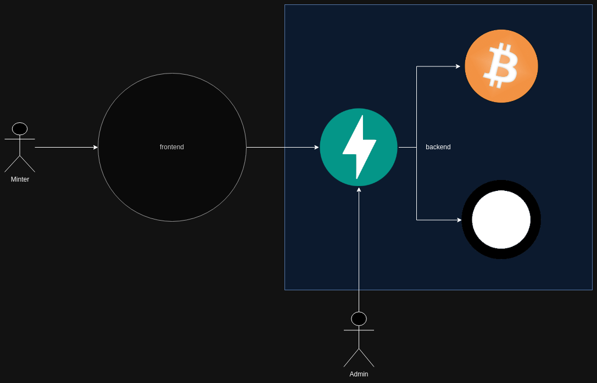
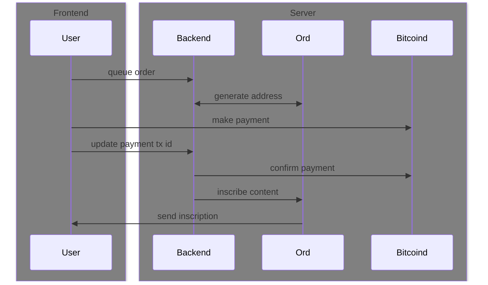

# ordimint-api

This is a [FastAPI](https://fastapi.tiangolo.com/) implementation for building [Bitcoin Ordinals](https://ordinals.com/) minting (inscribing) sites. It's an alternative to using third party services and is geared towards people wanting a more custom experience for their projects. It does not currently support Rune etching and inscribing though it may in the future (if I feel like it).

## How It Works

It is intended to be run on a server running both [Bitcoin Core](https://bitcoin.org/en/bitcoin-core/) (bitcoind) and [ord server](https://github.com/ordinals/ord).

You expose the API to the internet and configure a frontend web site to interact with the few endpoints.

- /fees - fetch and cache recent fees from [mempool.space](https://mempool.space)
- /create - create a new order for users to pay funds to
- /update - updates the order with a transaction ID of sent funds
- /status - overall mint status such as price and supply
- /orders/{address} - orders for a given wallet address
- /inscriptions/{address} - inscriptions for a given wallet address

### Users Create Orders

An "order" is an intent to provide funds. You can view the attributes for an order in [the database model](./api/models.py). Users will create an "order" by providing their wallet address to receive inscriptions, the fee sats per vbyte they want to pay for inscriptions, and the amount of Ordinals they wish to purchase. Some of the fee amounts will be pre-calculated in the backend but the order will essentially remain open until processing approves the order.

Orders are initially "queued" until picked up by the [background processing task](./process.py). This is primarily done to avoid server overload by I/O blocking `ord` CLI.

### Backend Checks Orders

The background processing will identify queued orders and generate a receive address unique to that order. This is how funds will be tracked for minters. Once the receive address has been generated the user will be able to provide funds for their order. When funds are sent the order being funded is updated with the incoming transaction ID.

### Backend Checks Transactions

Once orders have transaction IDs saved they will be continuously checked for correct balances and block confirmations. Once the transaction has been confirmed, assuming the amount sent is correct, the background process will mark the order as ready to inscribe.

### Backend Inscribes Content

